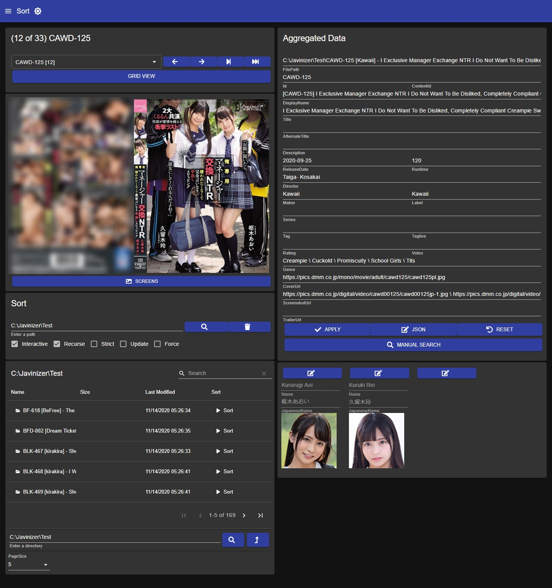

# Javinizer (JAV Organizer)

A command-line or GUI based tool to scrape and sort your local Japanese Adult Video (JAV) files.

- [View GUI demo video here](https://gfycat.com/spiriteddefenselessgrouper)
- [View GUI screens here](https://github.com/jvlflame/Javinizer/tree/master/media/gui)

## Overview

Javinizer is used to build a local JAV collection in a media library like Plex, Jellyfin, Emby, or Kodi.

Javinizer detects your local JAV files and structures them into media library compatible formats. Nfo metadata files are created to be read by the media library.

Javinizer currently supports the following scraper sources:

- Javlibrary
- R18
- Dmm
- Javbus
- Jav321
- AVEntertainment
- MGStage
- DLGetchu

## Installation & Usage

Documentation now lives in gitbook.

[View Javinizer installation and usage documentation here.](https://docs.jvlflame.net/)
