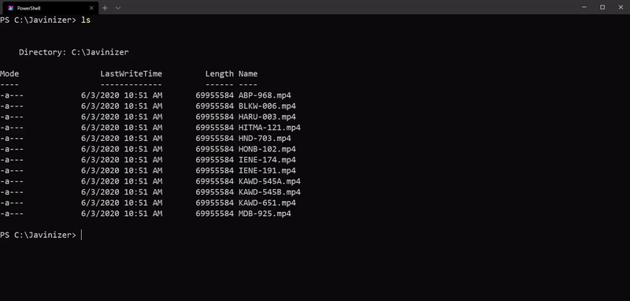

# Javinizer (JAV Organizer)
[](https://dev.azure.com/jli141928/Javinizer/_build/latest?definitionId=2&branchName=master)
[](https://github.com/jvlflame/Javinizer/releases)
[](#)
[](https://github.com/jvlflame/Javinizer/commits/master)
[](https://discord.gg/K2Yjevk)

A command-line based tool to scrape and sort your local Japanese Adult Video (JAV) files.



## Overview

Build a local JAV media library in a content management system (CMS) like Plex, Jellyfin, or Emby.

A rebuild of my previous project [JAV-Sort-Scrape-javlibrary](https://github.com/jvlflame/JAV-Sort-Scrape-javlibrary) as a console-focused application.

[View changelog](.github/CHANGELOG.md)

## Installation

### Install module dependencies

- [PowerShell 6, PowerShell 7](https://github.com/PowerShell/PowerShell) - Windows PowerShell 5 is **NOT** supported
    - [PoshRSJob](https://github.com/proxb/PoshRSJob)
- [Python 3+ (64-bit)](https://www.python.org/downloads/) - Linux calls `python3`
    - [Cloudscraper](https://pypi.org/project/cloudscraper/)
    - [Pillow](https://pypi.org/project/Pillow/)
    - [Googletrans](https://pypi.org/project/googletrans/)

```powershell
# pwsh
PS> Install-Module PoshRSJob

# python (Windows)
> pip install cloudscraper
> pip install pillow
> pip install googletrans

# python (Linux)
> pip3 install cloudscraper
> pip3 install pillow
> pip3 install googletrans
```

### Install the Javinizer module

Choose one of the methods below:

- Install the module directly from [PowerShell Gallery](https://www.powershellgallery.com/packages/Javinizer/0.1.7).
```powershell
# Install the module from PowerShell gallery
PS> Install-Module Javinizer

# Update the module to the newest version from PowerShell gallery
PS> Update-Module Javinizer
```

- Clone the repository or [download the latest release](https://github.com/jvlflame/Javinizer/releases)

```powershell
# Import the module (you will need to run this every time you open a new shell)
PS> Import-Module ./Javinizer.psm1

# Or add the module files to your appropriate PowerShell version module path
PS> $env:PSModulePath
```

## Usage

### Module settings

Please look over the `settings.ini` file located in the root `Javinizer` module folder. The settings file contains important fields that you will need to fill out to effectively use the Javinizer program.

```powershell
# Opens your settings.ini file
PS> Javinizer -OpenSettings

# Backup your settings.ini and r18-thumbs.csv file to an archive, use if you want to persist your settings between module upgrades
PS> Javinizer -BackupSettings 'C:\Users\UserName\Documents\JavinizerSettings.zip'

# Restore your backup settings archive to the module folder
PS> Javinizer -RestoreSettings 'C:\Users\UserName\Documents\JavinizerSettings.zip'
```


### Supported multi-part-video naming schemes

```
# Naming schemes  - Example filename
------------------------------------
ID-###[a-iA-I]    - ID-069A, ID-069B
ID-###-[a-iA-I]   - ID-069-a, ID-069-b
ID-###-\d         - ID-069-1, ID-069-2
ID-###-0\d        - ID-069-01, ID-069-02
ID-###-00\d       - ID-069-001, ID-069-003
ID-###-pt\d       - ID-069-pt1, ID-069-pt2
ID-### - pt\d     - ID-069 - pt1, ID-069 - pt2
ID-###-part\d     - ID-069-part1, ID-069-part2
ID-### - part\d   - ID-069 - part1, ID-069 - part2
ID-###_\d         - ID-069_1, ID-069_2
ID-###_0\d        - ID-069_01, ID-069_02
```

### Command-line switches

```
PS> help Javinizer

NAME
    Javinizer

SYNOPSIS
    A command-line based tool to scrape and sort your local Japanese Adult Video (JAV) files


SYNTAX
    Javinizer [[-Path] <String>] [[-DestinationPath] <String>] [-Url <String>] [-Apply] [-Multi] [-Recurse] [-Force] [-R18] [-Dmm] [-Javlibrary] [-ScriptRoot <String>] [<CommonParameters>]

    Javinizer [-Find] <String> [-Aggregated] [-R18] [-Dmm] [-Javlibrary] [-ScriptRoot <String>] [<CommonParameters>]

    Javinizer [-Help] [-ScriptRoot <String>] [<CommonParameters>]

    Javinizer [-OpenSettings] [-BackupSettings] [-RestoreSettings] [-ScriptRoot <String>] [<CommonParameters>]

    Javinizer [-GetThumbs] [-UpdateThumbs <Int32>] [-OpenThumbs] [-ScriptRoot <String>] [<CommonParameters>]


DESCRIPTION
    Javinizer is used to pull data from online data sources such as JAVLibrary, DMM, and R18 to aggregate data into a CMS (Plex,Emby,Jellyfin) parseable format.


PARAMETERS
    -Find <String>
        The find parameter will output a list-formatted data output from the data sources specified using a movie ID, file path, or URL.

    -Aggregated [<SwitchParameter>]
        The aggregated parameter will create an aggregated list-formatted data output from the data sources specified as well as metadata priorities in your settings.ini file.

    -Path <String>
        The path parameter sets the file or directory path that Javinizer will search and sort files in.

    -DestinationPath <String>
        The destinationpath parameter sets the directory path that Javinizer will send sorted files to.

    -Url <String>
        The url parameter allows you to set direct URLs to JAVLibrary, DMM, and R18 data sources to scrape a video from in direct URLs comma-separated-format (url1,url2,url3).

    -Apply [<SwitchParameter>]
        The apply parameter allows you to automatically begin your sort using settings specified in your settings.ini file.

    -Multi [<SwitchParameter>]
        The multi parameter will perform your sort using multiple concurrent threads with a throttle limit of (1-5) set in your settings.ini file.

    -Recurse [<SwitchParameter>]
        The recurse parameter will perform your sort recursively within your specified sort directory.

    -Force [<SwitchParameter>]
        The force parameter will attempt to force any new sorted files to be overwritten if it already exists.

    -Help [<SwitchParameter>]
        The help parameter will open a help dialogue in your console for Javinizer usage.

    -OpenSettings [<SwitchParameter>]
        The opensettings parameter will open your settings.ini file for you to view and edit.

    -BackupSettings <String>
        The backupsettings parameter will backup your settings.ini and r18-thumbs.csv file to an archive.

    -RestoreSettings <String>
        The restoresettings parameter will restore your archive created from the backupsettings parameter to the root module folder.

    -GetThumbs [<SwitchParameter>]
        The getthumbs parameter will fully update your R18 actress and thumbnail csv database file which will attempt to write unknown actress thumburls on sort.

    -UpdateThumbs <Int32>
        The updatethumbs parameter will partially update your R18 actress and thumbnail csv database file with a specified number of R18.com pages.

    -OpenThumbs [<SwitchParameter>]
        The openthumbs parameter will open your r18-thumbs.csv file for you to view and edit.

    -SetEmbyActorThumbs [<SwitchParameter>]
        The setembyactorthumbs parameter will POST matching R18 actor images from `r18-thumbs.csv` to your Emby or Jellyfin instance.

    -R18 [<SwitchParameter>]
        The r18 parameter allows you to set your data source of R18 to true.

    -Dmm [<SwitchParameter>]
        The dmm parameter allows you to set your data source of DMM to true.

    -Javlibrary [<SwitchParameter>]
        The javlibrary parameter allows you to set your data source of JAVLibrary to true.

    -ScriptRoot <String>
        The scriptroot parameter sets the default Javinizer module directory. This should not be touched.

    <CommonParameters>
        This cmdlet supports the common parameters: Verbose, Debug,
        ErrorAction, ErrorVariable, WarningAction, WarningVariable,
        OutBuffer, PipelineVariable, and OutVariable. For more information, see
        about_CommonParameters (https://go.microsoft.com/fwlink/?LinkID=113216).

```

### Examples

```powershell
    -------------------------- EXAMPLE 1 --------------------------

    # Opens your Javinizer settings.ini file in the root module directory.
    PS> Javinizer -OpenSettings

    -------------------------- EXAMPLE 2 --------------------------

    # Performs a multi-threaded sort on C:\Downloads\Unsorted with settings specified in your settings.ini file.
    PS> Javinizer -Path C:\Downloads\Unsorted -Multi

    -------------------------- EXAMPLE 3 --------------------------

    # Performs a multi-threaded sort on your directories with settings specified in your settings.ini file.
    PS> Javinizer -Apply -Multi

    -------------------------- EXAMPLE 4 --------------------------

    # Performs a single-threaded recursive sort on your specified Path with other settings specified in your settings.ini file.
    PS> Javinizer -Path C:\Downloads -DestinationPath C:\Downloads\Sorted -Recurse

    -------------------------- EXAMPLE 5 --------------------------

    # Performs a single-threaded sort on your specified file using direct URLs to match the file.
    PS> Javinizer -Path 'C:\Downloads\Jav\snis-620.mp4' -DestinationPath C:\Downloads\JAV\Sorted\ -Url 'http://www.javlibrary.com/en/?v=javlilljyy,https://www.r18.com/videos/vod/movies/detail/-/id=snis00620/?i3_ref=search&i3_ord=1,https://www.dmm.co.jp/digitalvideoa/-/detail/=/cid=snis00620/?i3_ref=search&i3_ord=4'

    -------------------------- EXAMPLE 6 --------------------------

    # Performs a console search of SNIS-420 for all data sources specified in your settings.ini file
    PS> Javinizer -Find SNIS-420

    -------------------------- EXAMPLE 7 --------------------------

    # Performs a console search of SNIS-420 for R18 and DMM and aggregates output to your settings specified in your settings.inifile.
    PS> Javinizer -Find SNIS-420 -R18 -DMM -Aggregated

    -------------------------- EXAMPLE 8 --------------------------

    # Performs a console search of PRED-200 using a direct url.
    PS> Javinizer -Find 'https://www.r18.com/videos/vod/movies/detail/-/id=pred00200/?dmmref=video.movies.new&i3_ref=list&i3_ord=2'

    -------------------------- EXAMPLE 9 --------------------------

    # Writes actor thumbnails to your Emby/Jellyfin server instance from your r18-thumbs.csv file.
    PS> Javinizer -SetEmbyActorThumbs

```

## Content Management System (CMS) Setup

| CMS | How to use |
| ------------- | ------------- |
| Plex  | Set-up a `Movie` library with custom agent [XBMCnfoMoviesImporter.bundle](https://github.com/gboudreau/XBMCnfoMoviesImporter.bundle).  |
| Emby | Set-up a `Movie` library with all metadata/image downloaders disabled. Use `Javinizer -SetEmbyActorThumbs` to set actress thumbnails. |
| Jellyfin | Set-up a `Movie` library with all metadata/image downloaders disabled. Use `Javinizer -SetEmbyActorThumbs` to set actress thumbnails. |

## Troubleshooting

| Issue | Resolution |
| ------------- | ------------- |
| Unicode error when trying to translate plot description  | Try setting in Windows 10: `Region Settings` -> `Beta: Use Unicode UTF-8 for worldwide language support`. |
| `crop.py` error when sorting multi-part videos using `-Multi` parameter | Ignore this error as it should not effect the end-result. |


## Todo
- [x] Trailer scraping - [0.1.2]
- [x] Multi-part video directory sort support - [0.1.2]
- [x] Parallel/Threaded sort processing - [0.1.7]
- [x] Allow switching firstname/lastname order - [0.1.7]
- [x] Add R18 actress thumburl scraping for non-r18 actress data source scrapes - [1.0.0]
- [x] Normalize genre names between JAVLibrary and R18 - [1.0.0]
- [ ] Normalize studio names between JAVLibrary and R18
- [ ] Add additional scraper sources for uncensored JAV
- [ ] Add functionality to POST Emby/Jellyfin actress images from `r18-thumbs.csv`

