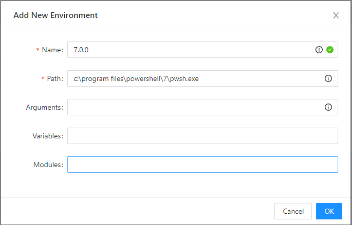

# Install Javinizer (Web GUI)


**The GUI version of Javinizer may not be updated at the same rate as the CLI version.**


**The Javinizer GUI supports two install methods:**

* [Docker](install-javinizer-web-gui.md#docker)
* [Windows](install-javinizer-web-gui.md#windows)

## Docker

Docker is the preferred method for installing and running the Javinizer Web GUI. The Javinizer image lives on [Docker Hub](https://hub.docker.com/r/javinizer/javinizer). To quickstart, run the following command:

```
docker run --name javinizer -p 8600:8600 -d javinizer/javinizer:latest
```

### Persisting Data

You will most likely want to persist settings data when running Javinizer within Docker.


**Your sort input and output paths should be using the same bind mount, otherwise moving files between them will take an extended amount of time.**


### Docker Run Example

```
docker run --name javinizer -p 8600:8600 -v path/to/jvSettings.json:/home/jvSettings.json -d javinizer/javinizer:latest
```

To persist your settings file, create a copy of the [settings file](../../src/Javinizer/jvSettings.json) and bind mount the file:&#x20;

* `/home/jvSettings.json`

To persist other settings files, set paths in your location settings.


### Docker Desktop Example

If you are using Docker Desktop with Hyper-V, you will want to make use of "File Sharing". In your Docker Desktop settings, add your mount directories and click Apply & Restart. Using WSL2, you will have to use a different method.


With the example path of `C:\javinizer\docker`, I can now run the following command to persist the PowerShell Universal appdata:

```
docker run --name Javinizer -p 8600:8600 -v C:/javinizer/docker/jvSettings.json:/home/jvSettings.json jvlflame/javinizer:latest
```

### Unraid Example

If you want to use Javinizer via Docker on Unraid, here is an example template.


## Windows

The Javinizer GUI can be installed on Windows.&#x20;

### Install Dependencies

You will need to install the Javinizer CLI and its dependencies. View the instructions on the [**Install Javinizer (CLI)**](install-javinizer-cli.md) page for details. This includes:

* PowerShell Core
* Python 3
  * googletrans module
  * google\_trans\_new module
  * pillow module
* MediaInfo (optional)
* Javinizer module

After installing Javinizer and its dependencies, **run PowerShell as administrator** and run the following command to install PowerShell Universal and other required modules.

```
Javinizer -InstallGUI
```

Once this installation has completed and both PowerShell and Python modules are installed, run the following command to open the GUI page.&#x20;

```
# Runs by default on port 8600
Javinizer -OpenGUI
```

```
# (Optional) You can set a custom port
Javinizer -OpenGUI -Port 8080
```

The `-OpenGUI` command will automatically open a page to`http://localhost:<PORT>/` which contains the Javinizer GUI. &#x20;

## Use Network Paths

If the files you want to sort live on a network path in Windows, it is likely that you will need to re-mount your network drives within an admin scope.

Run PowerShell or CMD as administrator and run the following command to mount your network drive. Substitute `g:` for the drive letter of your choice.

```
# Network drive
net use g: \\server\share

# Network drive that requires authentication
net use g: \\server\share /user:<username> <password>
```

If you are still unable to see your network drive after mounting via an administrator prompt, you can mount your drive directly from the **Admin** tab in the Javinizer GUI.


## Add PowerShell 7 Environment

If your PowerShell Universal did not automatically detect your PowerShell 7 installation, you can add it manually.&#x20;

1. Navigate to the PowerShell Universal admin page
   1. `http://localhost:<PORT>/admin`
   2. Username is `admin` with any password
2. On the sidebar, navigate to Settings -> Environments
3. Click the **Add** button
4. Fill in the **Name** and **Path** entries and click **OK**
5. On the sidebar, navigate to Dashboards -> Dashboards and edit the existing Javinizer dashboard entry
6. Set the environment to the new environment that you created

<figure><figcaption></figcaption></figure>
