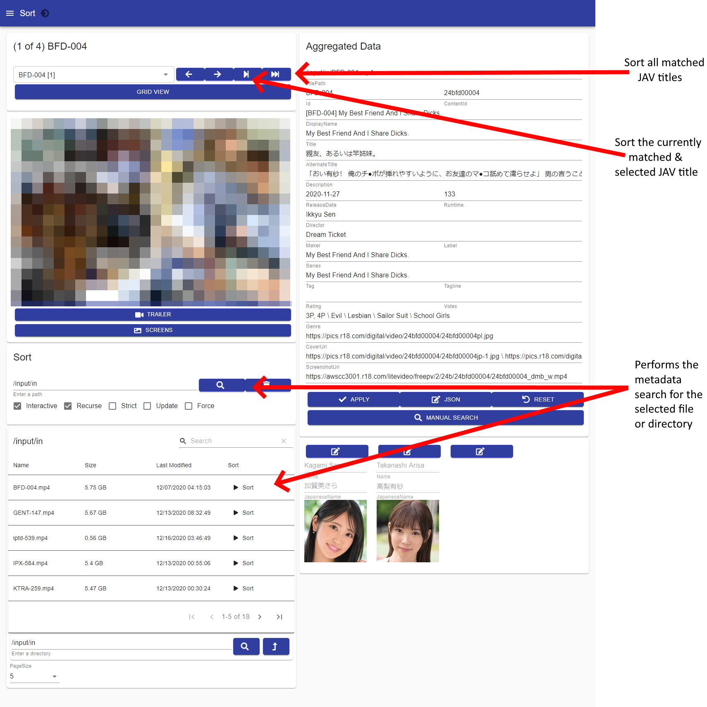

# Using the GUI

If you receive the `/not-running` page, it is likely that the browser opened before the dashboard finished starting. Simply remove the `/not-running` from the URL and refresh the page.

<figure><figcaption></figcaption></figure>

If that does not resolve the issue, login to the PowerShell Universal admin portal at `http://ip:<port>/admin` and login with credentials:

* Username: Admin
* Password: 123 (or anything)

Check the dashboards page and make sure that the Javinizer dashboard is running.

<figure><figcaption></figcaption></figure>
